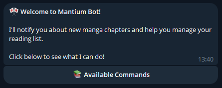
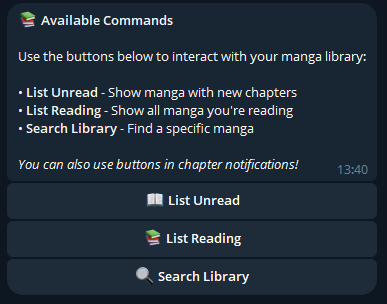
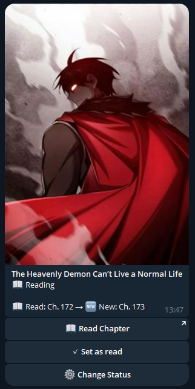
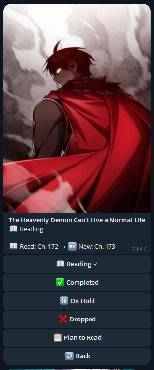
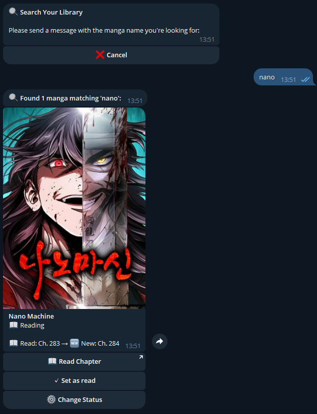

# Telegram Bot Integration

This fork includes a powerful Telegram bot that allows you to receive notifications about new manga chapters and manage your reading list directly from Telegram.

## Features

The Telegram bot provides the following capabilities:

- **📬 Automatic Notifications**: Receive instant notifications when new chapters are released for manga you're following
- **✅ Quick Actions**: Mark chapters as read directly from notification messages
- **📖 List Management**: View your unread manga and reading list
- **🔍 Search**: Search your manga library
- **⚙️ Status Management**: Change manga status (Reading, Completed, On Hold, Dropped, Plan to Read)
- **🖼️ Rich Media**: Get manga cover images alongside information


## Screenshots

### 🏠 Welcome & Commands

| Welcome Screen                            | Available Commands                              |
| ----------------------------------------- | ----------------------------------------------- |
|  |  |

### 🔔 Notifications & Quick Actions

| Notification Example                 |
| ------------------------------------ |
|  |

### 📚 Manga Management

| Manga List                 | Status Menu                 | Search                    |
| -------------------------- | --------------------------- | ------------------------- |
|  |  |  |

## Environment Variables

To enable the Telegram bot integration, add the following environment variables to your configuration:

```env
# Telegram Bot Configuration
TELEGRAM_API_TOKEN=your_bot_token_here
TELEGRAM_CHAT_IDS=123456789,987654321
TELEGRAM_ENABLE_POLLING=true
```

### Variable Descriptions

| Variable | Required | Description |
|----------|----------|-------------|
| `TELEGRAM_API_TOKEN` | Yes | Your Telegram bot API token obtained from BotFather |
| `TELEGRAM_CHAT_IDS` | Yes | Comma-separated list of Telegram chat IDs that can interact with the bot |
| `TELEGRAM_ENABLE_POLLING` | No | Enable interactive bot features (commands and buttons). Set to `true` to enable, `false` or omit for notification-only mode |

## Setting Up Your Telegram Bot

### Step 1: Create a Bot with BotFather

1. Open Telegram and search for [@BotFather](https://t.me/botfather)
2. Start a conversation and send the command `/newbot`
3. Follow the prompts to:
   - Choose a name for your bot (e.g., "My Mantium Bot")
   - Choose a username for your bot (must end in 'bot', e.g., "my_mantium_bot")
4. BotFather will provide you with an API token that looks like this: `123456789:ABCdefGHIjklMNOpqrsTUVwxyz`
5. **Save this token** - you'll need it for the `TELEGRAM_API_TOKEN` environment variable

### Step 2: Get Your Chat ID

To receive messages from the bot, you need to provide your Telegram chat ID:

1. Search for [@userinfobot](https://t.me/userinfobot) on Telegram
2. Start a conversation with the bot
3. It will reply with your user information, including your **ID** number
4. Copy this number - this is your chat ID

**For group chats:**
1. Add your bot to the group
2. Send a message in the group
3. Visit `https://api.telegram.org/bot<YOUR_BOT_TOKEN>/getUpdates` in your browser
4. Look for the `chat` object and find the `id` field (group IDs are negative numbers)


### Step 3: Configure Environment Variables

Add the collected information to your environment configuration:

```env
TELEGRAM_API_TOKEN=123456789:ABCdefGHIjklMNOpqrsTUVwxyz
TELEGRAM_CHAT_IDS=987654321
TELEGRAM_ENABLE_POLLING=true
```

**For multiple users/groups**, separate chat IDs with commas:
```env
TELEGRAM_CHAT_IDS=123456789,987654321,-1001234567890
```

### Step 4: Start the Application

Once configured, start or restart your Mantium application. You should see a log message confirming the bot initialization:

```
✅ Telegram bot initialized successfully and polling started
```

### Step 5: Test Your Bot

1. Open Telegram and find your bot (search for the username you created)
2. Send the `/start` command
3. You should receive a welcome message with an interactive menu


*Screenshot: Testing the bot with the /start command*

## Bot Modes

The bot can operate in two modes:

### 1. Notification-Only Mode
Set `TELEGRAM_ENABLE_POLLING=false` or omit this variable.

**Features:**
- Receive notifications about new manga chapters
- Simple URL buttons to read chapters
- No interactive commands or callbacks

**Best for:** Users who only want notifications without bot interaction.

### 2. Interactive Mode (Recommended)
Set `TELEGRAM_ENABLE_POLLING=true`

**Features:**
- All notification-only features
- Interactive commands (see Commands section)
- Inline buttons for quick actions
- Mark chapters as read from notifications
- Search and manage your library

**Best for:** Full bot functionality with complete library management.


## Available Commands

When polling is enabled, the bot supports the following commands:

### Main Commands

| Command | Description |
|---------|-------------|
| `/start` | Display welcome message and main menu |
| `/help` | Show available commands with interactive buttons |
| `/listunread` | Show all manga with unread chapters |
| `/listreading` | Show all manga you're currently reading |
| `/search` | Search for manga in your library |
| `/setlastread <manga_id>` | Manually mark the latest chapter as read for a specific manga |


*Screenshot: The help menu showing all available commands*

### Interactive Features

The bot provides rich interactive features through inline buttons:

#### Chapter Notifications
When a new chapter is released, you'll receive a notification with:
- Manga cover image
- Manga name and chapter number
- "Set as read" button to mark the chapter as read instantly


*Screenshot: A new chapter notification with the "Set as read" button (interactive mode)*

#### Manga List View
Lists display manga with:
- Cover image
- Current status (Reading, Completed, etc.)
- Last read chapter and latest released chapter
- Quick action buttons:
  - "📖 Read Chapter" - Opens the chapter URL
  - "✅ Set as read" - Marks the latest chapter as read
  - "⚙️ Change Status" - Opens status selection menu


*Screenshot: List of unread manga with cover images and action buttons*

#### Status Management
Change manga status through an interactive menu:
- 📖 Reading
- ✅ Completed
- ⏸️ On Hold
- ❌ Dropped
- 📋 Plan to Read


*Screenshot: Status selection menu for a manga*

#### Search Functionality
1. Use `/search` or click the "🔍 Search Library" button
2. Bot prompts you to enter a manga name
3. Send your search query as a regular message
4. Bot returns matching manga with full cards and action buttons


*Screenshot: Search functionality showing results*

## Usage Examples

### Receiving a New Chapter Notification

When a new chapter is released:

1. You receive a notification with the manga cover and chapter information
2. Click "✅ Set as read" to mark it as read immediately
3. Or click "📖 Read Chapter" to open the chapter in your browser

### Checking Unread Manga

1. Send `/listunread` or use the button in the help menu
2. The bot displays up to 5 manga at a time with cover images
3. Each manga shows:
   - Your last read chapter
   - The latest released chapter
   - Quick action buttons
4. Click "📖 Show more" if you have more than 5 unread manga

### Changing Manga Status

1. From any manga card, click "⚙️ Change Status"
2. Select the new status from the menu
3. The current status is marked with a checkmark ✓
4. After selection, the manga card updates to show the new status

### Searching Your Library

1. Send `/search` or click the search button
2. Type the name of the manga you're looking for
3. The bot shows all matching manga from your library
4. Each result is displayed as a full manga card with actions

## Troubleshooting

### Bot doesn't respond to commands

**Problem:** You send commands but receive no response.

**Solutions:**
- Verify `TELEGRAM_ENABLE_POLLING=true` is set in your environment
- Check that your chat ID is in the `TELEGRAM_CHAT_IDS` list
- Restart the application and look for the initialization success message
- Ensure the bot isn't blocked by your Telegram privacy settings

### Not receiving notifications

**Problem:** New chapters are released but no notifications arrive.

**Solutions:**
- Verify `TELEGRAM_API_TOKEN` is correct
- Check that your chat ID is in the `TELEGRAM_CHAT_IDS` list
- Ensure the manga tracking system is running properly
- Check application logs for any Telegram-related errors

### "Set as read" button doesn't work

**Problem:** Clicking the button shows an error or does nothing.

**Solutions:**
- This feature requires `TELEGRAM_ENABLE_POLLING=true`
- Ensure the API is running and accessible
- Check application logs for error messages
- Verify the manga ID is valid

### Bot token errors

**Problem:** Error messages about invalid token.

**Solutions:**
- Verify you copied the complete token from BotFather
- Ensure there are no extra spaces in the `TELEGRAM_API_TOKEN` variable
- Confirm the token hasn't been revoked in BotFather
- Try generating a new token with BotFather if needed

## Technical Details

### Callback Data Structure

The bot uses a compact JSON structure for inline button callbacks to stay within Telegram's 64-byte callback data limit:

```json
{
  "a": "action_name",
  "m": "manga_id",
  "c": "chapter_id",
  "s": status_value,
  "o": offset_value,
  "cmd": "command_type"
}
```

### API Integration

The bot communicates with the Mantium API running on `localhost` using the configured port. All manga operations (marking as read, changing status, fetching lists) go through the REST API.

### Session Management

When using interactive features like search, the bot maintains user sessions to handle multi-step interactions. Sessions are stored in memory and cleared when:
- The user completes the action
- A new command is issued
- The cancel button is clicked

## Security Considerations

1. **Keep your bot token secret** - Never share it publicly or commit it to version control
2. **Restrict chat IDs** - Only add trusted users/groups to `TELEGRAM_CHAT_IDS`
3. **Use HTTPS** - The Telegram API uses HTTPS by default for secure communication
4. **Monitor bot usage** - Check logs regularly for unexpected activity

## Additional Resources

- [Telegram Bot API Documentation](https://core.telegram.org/bots/api)
- [BotFather Commands](https://core.telegram.org/bots#botfather)
- [Telegram Bot Best Practices](https://core.telegram.org/bots/best-practices)

---

For more information about Mantium, visit the main [README](../README.md).